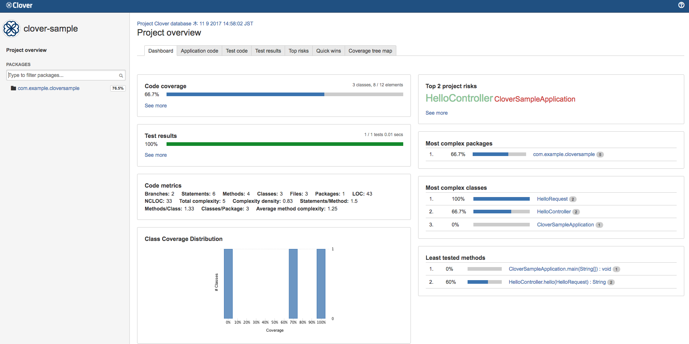
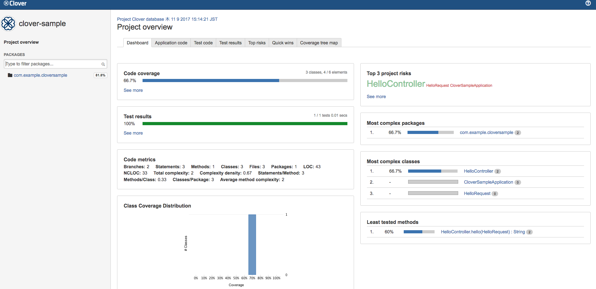

# このリポジトリについて
* clover+gradleでテストカバレッジを出力する際にどういう設定するか試したもの
* Spring bootのプロジェクトで使った

# 依存
依存先|ライセンス
---|---
[clover](https://confluence.atlassian.com/clover/clover-documentation-home-71598318.html)|Apache 2.0 license
[bmuschko/gradle-clover-plugin](https://github.com/bmuschko/gradle-clover-plugin)|Apache 2.0 license

# カバレッジをとりあえず出力してみる
## とりあえず動かす
#### build.gradleに依存とか書く
下記のようにbuildscript内のdependenciesにgradle-clover-pluginを追記

```
buildscript {
	dependencies {
		classpath 'com.bmuschko:gradle-clover-plugin:2.1.3'
	}
}
```

pluginを適用する設定追記

```
apply plugin: 'com.bmuschko.clover'
```

dependenciesにcloverを追記

```
dependencies {
	clover 'org.openclover:clover:4.2.0'
}
```

cloverの設定を記述する

```
clover {
	report {
		html = true
	}
}
```

Spring bootで作ったプロジェクトで最終的に出来上がったbuild.gradleは下記の通り

```
buildscript {
	ext {
		springBootVersion = '1.5.8.RELEASE'
	}
	repositories {
		mavenCentral()
	}
	dependencies {
		classpath("org.springframework.boot:spring-boot-gradle-plugin:${springBootVersion}")
		classpath 'com.bmuschko:gradle-clover-plugin:2.1.3'
	}
}

apply plugin: 'java'
apply plugin: 'eclipse'
apply plugin: 'org.springframework.boot'
apply plugin: 'com.bmuschko.clover'

group = 'com.example'
version = '0.0.1-SNAPSHOT'
sourceCompatibility = 1.8

repositories {
	mavenCentral()
}

clover {
	report {
		html = true
		filter = 'main'
	}
}

dependencies {
	compile('org.springframework.boot:spring-boot-starter-web')
	compileOnly('org.projectlombok:lombok')
	testCompile('org.springframework.boot:spring-boot-starter-test')
	clover 'org.openclover:clover:4.2.0'
}

```

## 適当なテスト書く
適当にどうぞ
 
## カバレッジを出力する
下記コマンドでテストが実行されてカバレッジのファイルが出力される

```
$ gradle clean cloverGenerateReport
```

## 出力された結果を見る
build結果にレポートのhtmlが生成されているのでそれをブラウザで見てみる  
このプロジェクトの場合下記のパスに配置されている

```
clover-sample/build/reports/clover/index.html
```

ブラウザでみるとこんな感じになる



## 解説
#### cloverの設定周り
* とりあえず動かすだけなら今回設定した内容だけで問題なくカバレッジが出力される
* デフォルトだとhtmlでカバレッジが出力されないためclover{report{html=true}}の設定をした

#### cloverで用意されるコマンド
利用できるコマンドは下記の通り

コマンド|用途
---|---
cloverGenerateReport|テスト実行してカバレッジ出力
cloverAggregateReports|複数のモジュールがあるプロジェクトのテストの実行結果を集計する(使ったことないからよくわからん)

# テスト対象をフィルタする
main関数とかgetter,setterをカバレッジ対象から除外してみる

## とりあえず動かす
cloverの設定に下記のように記述してカバレッジを出力する

```
clover {
	contexts {
		method {
			name = 'main'
			regexp = 'public static void main\\(String\\[\\] args\\).*'
		}
	}
	report {
		html = true
		filter = 'main,property'
	}
}
```

###### 出力結果


## 解説
* ここではcloverで元々用意されているフィルタと自分で設定するものを使ってみた
* 自作する場合はcontextsでmethodを用意すると使える
* 用意されているフィルタ一覧は[公式のドキュメント](https://confluence.atlassian.com/clover/using-coverage-contexts-72548355.html)を参照するとよい

# 雑感
* 大した設定なしでフィルターできるのが便利だと感じた
* [Atlassianが用意しているgradleのプラグイン](https://bitbucket.org/atlassian/gradle-clover-plugin?_ga=2.266798091.46820302.1510133286-996513027.1507784494)も存在しているがまだalphaなので今回はそれは使わなかった
* gradleの使用例が少なかったので最初面倒くさいなーって思ったけど今回利用したpluginのREADMEがわかりやすかったのですんなり使えた
